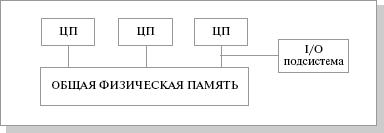
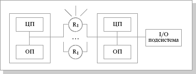

# Домашнее задание к занятию 10.2 «Кластеризация» Андрей Дёмин

---

### Задание 1

В чём различие между SMP- и MPP-системами?

*Приведите ответ в свободной форме.*

<ins>SMP (symmetric multiprocessing)</ins> – симметричная многопроцессорная архитектура. Главной особенностью систем с архитектурой SMP является наличие общей физической памяти, разделяемой всеми процессорами. Память служит, в частности, для передачи сообщений между процессорами, при этом все вычислительные устройства при обращении к ней имеют равные права и одну и ту же адресацию для всех ячеек памяти. Поэтому SMP-архитектура называется симметричной.
Системы с общей памятью плохо масштабируются. Этот существенный недостаток SMP-систем не позволяет считать их по-настоящему перспективными. Причиной плохой масштабируемости является то, что в данный момент шина способна обрабатывать только одну транзакцию, вследствие чего возникают проблемы разрешения конфликтов при одновременном обращении нескольких процессоров к одним и тем же областям общей физической памяти. Вычислительные элементы начинают друг другу мешать. Когда произойдет такой конфликт, зависит от скорости связи и от количества вычислительных элементов. В настоящее время конфликты могут происходить при наличии 8-24 процессоров. Кроме того, системная шина имеет ограниченную (хоть и высокую) пропускную способность (ПС) и ограниченное число слотов. Все это очевидно препятствует увеличению производительности при увеличении числа процессоров и числа подключаемых пользователей. В реальных системах можно задействовать не более 32 процессоров.

<ins>MPP (massive parallel processing)</ins> – массивно-параллельная архитектура. Главная особенность такой архитектуры состоит в том, что память физически разделена. В этом случае система строится из отдельных модулей, содержащих процессор, локальный банк операционной памяти (ОП), коммуникационные процессоры (рутеры) или сетевые адаптеры, иногда – жесткие диски и/или другие устройства ввода/вывода. По сути, такие модули представляют собой полнофункциональные компьютеры. Доступ к банку ОП из данного модуля имеют только процессоры (ЦП) из этого же модуля. Модули соединяются специальными коммуникационными каналами. Пользователь может определить логический номер процессора, к которому он подключен, и организовать обмен сообщениями с другими процессорами. Используются два варианта работы операционной системы (ОС) на машинах MPP-архитектуры. В одном полноценная операционная система (ОС) работает только на управляющей машине (front-end), на каждом отдельном модуле функционирует сильно урезанный вариант ОС, обеспечивающий работу только расположенной в нем ветви параллельного приложения. Во втором варианте на каждом модуле работает полноценная UNIX-подобная ОС, устанавливаемая отдельно.
Главным преимуществом систем с раздельной памятью является хорошая масштабируемость: в отличие от SMP-систем, в машинах с раздельной памятью каждый процессор имеет доступ только к своей локальной памяти, в связи с чем не возникает необходимости в потактовой синхронизации процессоров. Практически все рекорды по производительности на сегодня устанавливаются на машинах именно такой архитектуры, состоящих из нескольких тысяч процессоров.

Недостатки:

отсутствие общей памяти заметно снижает скорость межпроцессорного обмена, поскольку нет общей среды для хранения данных, предназначенных для обмена между процессорами. Требуется специальная техника программирования для реализации обмена сообщениями между процессорами;

каждый процессор может использовать только ограниченный объем локального банка памяти;

вследствие указанных архитектурных недостатков требуются значительные усилия для того, чтобы максимально использовать системные ресурсы. Именно этим определяется высокая цена программного обеспечения для массивно-параллельных систем с раздельной памятью.

---

### Задание 2

В чём отличие сильно связанных и слабо связанных систем?

*Приведите ответ в свободной форме.*

Основное различие между слабо связанной и сильно связанной многопроцессорной системой состоит в том, что слабосвязанная система имеет распределенную память, тогда как сильносвязанная система имеет общую память. 

---

### Задание 3

Какие преимущества отличают кластерные системы от обычных серверов?

*Приведите ответ в свободной форме.*

Кластерные системы отличаются следующими достоинствами:

- Большая надежность. При отказе компьютера, входящего в кластер, используются ресурсы прочих серверов из того же кластера.
- Высокая масштабируемость. В случае если нагрузка на кластер возрастет, в него просто добавляют еще один сервер.
- Возможность перераспределения ресурсов серверов. 

---

### Задание 4

Приведите примеры типов современных кластерных систем.

*Приведите ответ в свободной форме.*

<ins>Отказоустойчивые кластеры (High-availability clusters)</ins>:
- Active/active - одна из самых популярных схем реализации отказоустойчивого кластер. Если один из серверов в кластере, построенном по схеме active/active, окажется недоступным, его трафик перераспределится между оставшимися узлами. Этот способ актуален в ситуациях, когда узлы кластера однородны с точки зрения аппаратного и программного обеспечения и выполняют одинаковые задачи.

- Active/passive - резервируется каждый узел в кластере. Резервный узел включается только при отказе основного. Несложно догадаться, что схема active/passive требует значительной избыточности.

- N+1 - в кластере есть один резервный узел, который берет на себя задачи вышедшего из строя сервера. После восстановления способности оборудования узел опять становится резервным. Схема N+1 может быть реализована в кластере с неоднородными задачами, при этом "запасной" узел должен будет суметь заменить любую машину из этого кластера.

- N+M - если одного резервного сервера недостаточно из-за разнородности сервисов и задач, которые обслуживают серверы в кластере, можно использовать схему N+M. В отличие от предыдущей она подразумевает, что в кластере будет не одна, а сразу несколько резервных машин. Такой способ построения отказоустойчивого кластера позволяет достичь компромисса между стоимостью решения и требуемым уровнем надежности.

<ins>Кластеры с балансировкой нагрузки (Load balancing clusters)</ins>:
Используют аппаратный или программный балансировщик нагрузки чтобы:
- Распределить запросы клиентов и нагрузку сети эффективным образом в во всем кластере серверов;
- Обеспечить высокую доступность и надежность посылкой запросов только на те серверы, которые находятся в режиме онлайн;
- Обеспечить гибкость, добавляя или удаляя серверы по мере надобности.

<ins>Вычислительные кластеры (High performance computing clusters)</ins>:
В общем случае представляют набор однородных по архитектуре и производительности вычислительных узлов, объединенных сетью. Каждый вычислительный узел имеет свою оперативную память и работает под управлением своей операционной системы. Для каждого кластера имеется выделенный компьютер - головная машина (front-end). На этой машине установлено программное обеспечение, которое управляет запуском программ на кластере. Собственно вычислительные процессы пользователей запускаются на вычислительных узлах, причем они распределяются так, что на каждый процессор приходится не более одного вычислительного процесса. Запускать вычислительные процессы на головной машине кластера нельзя.

<ins>Системы распределенных вычислений</ins>:
Существует четыре основных типа распределенной архитектуры:

1. Клиент-серверная архитектура – это самый распространенный способ организации распределенной системы. Компьютеры выполняют две роли: клиенты и серверы.
Преимуществами клиент-серверной архитектуры являются безопасность и простота текущего обслуживания. Нужно уделять основное внимание только защите серверов. Кроме того, любые изменения в системах баз данных требуют изменений только на сервере.Ограничением клиент-серверной архитектуры является то, что серверы могут стать узким местом в связи, особенно когда несколько компьютеров отправляют запросы одновременно.
2. В трехуровневых распределенных системах клиентские компьютеры остаются на первом уровне доступа. С другой стороны, серверные компьютеры делятся еще на две категории. Серверы приложений – это средний уровень связи. Они содержат логику приложений или основные функции, для выполнения которых предназначена распределенная система. Серверы баз данных – это третий уровень, на котором осуществляется хранение данных и управление ими. Они отвечают за получение данных и их целостность.
Благодаря разделению ответственности на сервере трехуровневая распределенная система сокращает количество узких мест в связи и повышает производительность распределенных вычислений.
3. N-уровневые модели состоят из нескольких различных клиент-серверных систем, которые взаимодействуют между собой для решения одной и той же проблемы. Большинство современных распределенных систем используют n-уровневую архитектуру, в которой разные корпоративные приложения совместно работают за кулисами как одна система.
4. Пиринговые распределенные системы возлагают на все компьютеры в сети одинаковые обязанности. Разделение на клиентские и серверные компьютеры отсутствует, и любой компьютер может выполнять все функции. Пиринговая архитектура стала популярной в сфере совместного использования контента, потоковой передачи файлов и сетях блокчейн.
---

### Задание 5

Где используют сервис Kafka, rabitMQ?

*Приведите ответ в свободной форме.*

Kafka Apache — распределенная система обмена сообщениями между серверными приложениями в режиме реального времени. Благодаря высокой пропускной способности, масштабируемости и надежности применяется в различных направлениях IT-индустрии, от сервисов потоковых видео до аналитики Big Data. ключевая задача, которую решает Kafka — организация потока данных из одной точки в другую и их опциональная обработка. Он может работать с разными видами событий — метрики, логи, данные систем мониторинга и другое. Apache Kafka позволяет существенно упростить архитектуру, сконцентрировав все сервисы вокруг лога.

Сценарии использования Apache Kafka:

<ins>Мониторинг активности посетителей веб-ресурса</ins>
Kafka можно использовать для «подписки» на потоки данных от различных генераторов событий. После внедрения инструмента все действия пользователей сайта (посещение страниц, клики по кнопкам, использование поиска и пр.) будут публиковаться в центральных топиках, причем каждый тип действий — в своем. Получившиеся фиды можно использовать совершенно по-разному: например, обрабатывать real-time, загружать в Hadoop или хранилища.

<ins>Обнаружение фрода</ins>
С помощью Apache Kafka можно строить сервисы выявления мошеннических или подозрительных действий. В этом случае его применяют на этапе сбора потоковых данных: в Kafka поступает информация от различных генераторов, например, сервисов онлайн-банкинга, а брокер передает эти данные в Spark, где они обрабатываются в режиме real-time.

<ins>Обработка логов игровых приложений</ins>
Игры генерируют огромное количество логов, которые затем хранятся в виде обычных файлов на физических серверах или ВМ. В связке с Apache Kafka эти ВМ могут выступать поставщиками данных, которые публикуют логи на брокере, откуда они уже передаются в обработку. Это позволяет работать не с разрозненными файлами, а сразу с потоком данных, которые можно транслировать, агрегировать, хранить и передавать на аналитику. Поскольку Apache Kafka отлично масштабируется и быстро работает, его можно использовать для загрузки данных в обработку в онлайн-режиме.

<ins>Бэкенд для архитектурной модели Event Sourcing</ins>
Event Sourcing — это архитектурный шаблон разработки приложений, согласно которому любые изменения состояния регистрируются в виде некой последовательности записей. Так как Apache Kafka умеет работать с «тяжелыми» логами, его можно использовать как бэкенд для приложений с применением Event Sourcing.

<ins>Анализ временных рядов</ins>
Kafka можно использовать не только для real-time данных — он отлично подходит для анализа информации, собранной в разное время. С его помощью можно проанализировать данные за циклически повторяющиеся моменты времени (за один и тот же сезон в разные годы, за все выходные и пр.) и, например, зафиксировать снижение спроса. При этом Kafka может получать данные из разных временных рядов, а затем передавать их в machine learning-приложения и другие сервисы.

---

## Задания со звёздочкой*
Эти задания дополнительные. Их можно не выполнять. На зачёт это не повлияет. Вы можете их выполнить, если хотите глубже разобраться в материале.

---

### Задание 6*

Исследуйте построение кластера на основе rabbitMQ: https://github.com/ypereirareis/docker-rabbitmq-ha-cluster. 
Используя docker-compose, соберите инфраструктуру. Исследуйте её работы.

Ответьте на вопросы.

- На каких компонетах развёрнут кластер?
- Назначение компонентов кластера.
- Какие тесты можно провести для анализа работы кластера?

*Приведите в пример скриншоты работающей системы и ответы на вопросы.*

